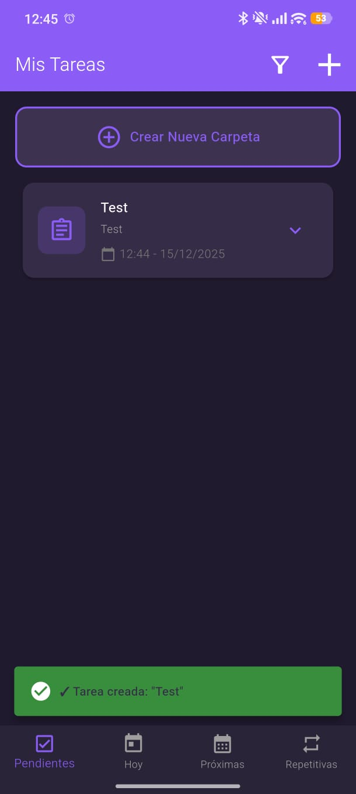
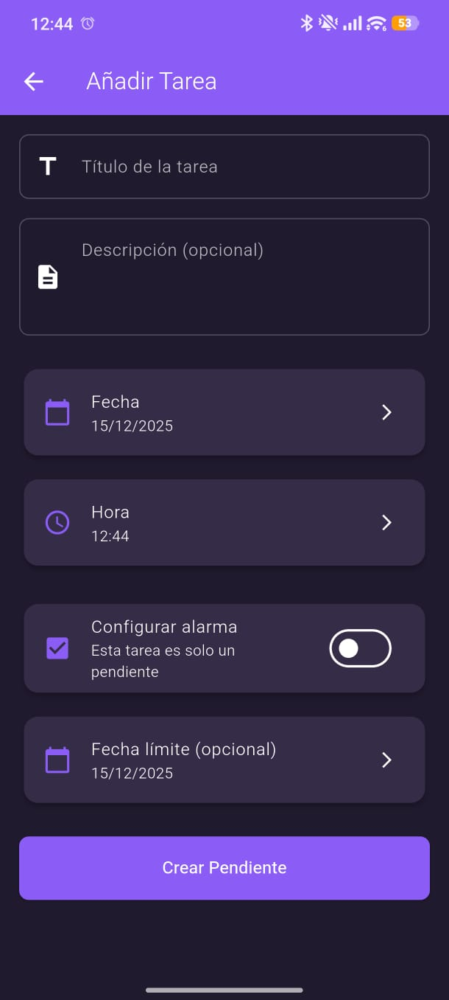
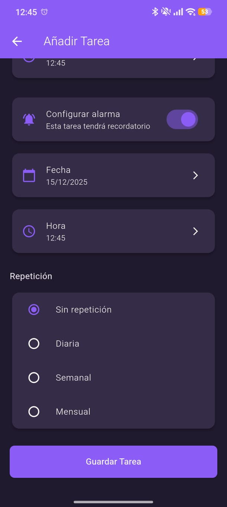

# Todo app 

An intuitive application to organize your daily tasks and reminders. Stay productive and on top of your everyday responsibilities with easy-to-use task management tools.

  

---

##  Table of Contents 📜

- [🛠️ Downloads](#️-downloads)
- [🐛 Reporting Bugs & Feedback](#-reporting-bugs--feedback)

---

### 🛠️ **Downloads**  
- [Download_Todo-APP](https://github.com/mesegr/ToDo-app/releases/download/V1.0.0/app-release.apk)

---

## 🐛 **Reporting Bugs & Feedback**  
Found a bug? Have suggestions?  
- Open an **Issue** on this repo.  

Please include:  
- **Description**: What happened?  
- **Steps to reproduce**: How can we trigger it?  
- **Screenshots/Videos** (if possible).  
  
